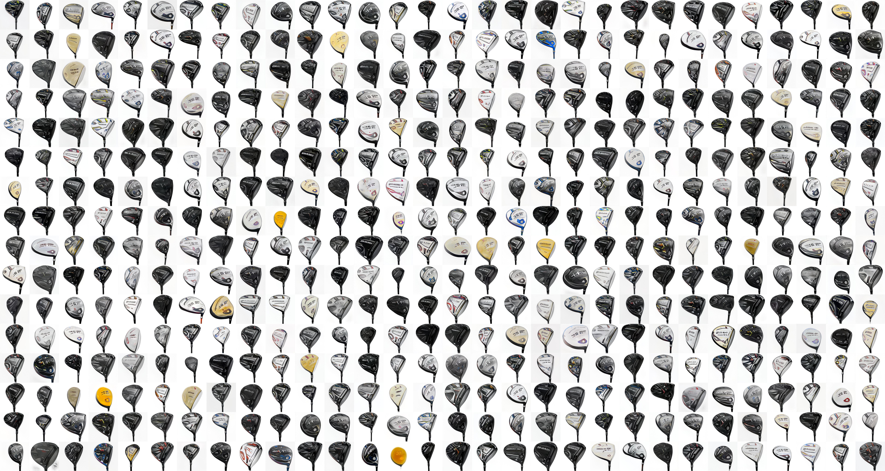

# www.thisgolfclubdoesnotexist.com

## Project
Generating "realistic" golf clubs using StyleGAN2-ADA model with Transfer-Learning

You have probably already heard of GANs. These Deep Learning models allow to generate images from a custom dataset. Made popular thanks to www.thispersondoesnotexist.com and qualified as “The most interesting idea in the last 10 years in Machine Learning” by Yann LeCun, GANs have been trained in many application domains (sneakers, album covers, stackoverflow questions, …) grouped here : www.thisxdoesnotexist.com.

The website: https://www.thisgolfclubdoesnotexist.com

## About this project
So I also wanted to learn how to generate 256x256 images using GANs. Being a golf enthusiast, one of my dream jobs when I was younger was to design golf clubs. Today I’m sort of fulfilling that dream by creating my own clubs without any particular design knowledge!

It is interesting to note the presence of text (which means nothing) in specific places that are often found on the clubs.
In short, the result is not really realistic, but it can make nice and cheap club designs.

## In this repo 
- club : is an extract of my dataset of clubs images
- Explained_process : Notebook with detailed explainations of each steps
- Light_process : Only the necessary blocks which allows you to easier restart training and colab disconnecting.

## Methodology
If you want to know more about this project, check my Medium article [here](https://medium.com/@fradin.nicolas/generating-golf-clubs-with-stylegan2-ada-i-created-the-new-golf-driver-design-1fd040d32eb1)

## Results

